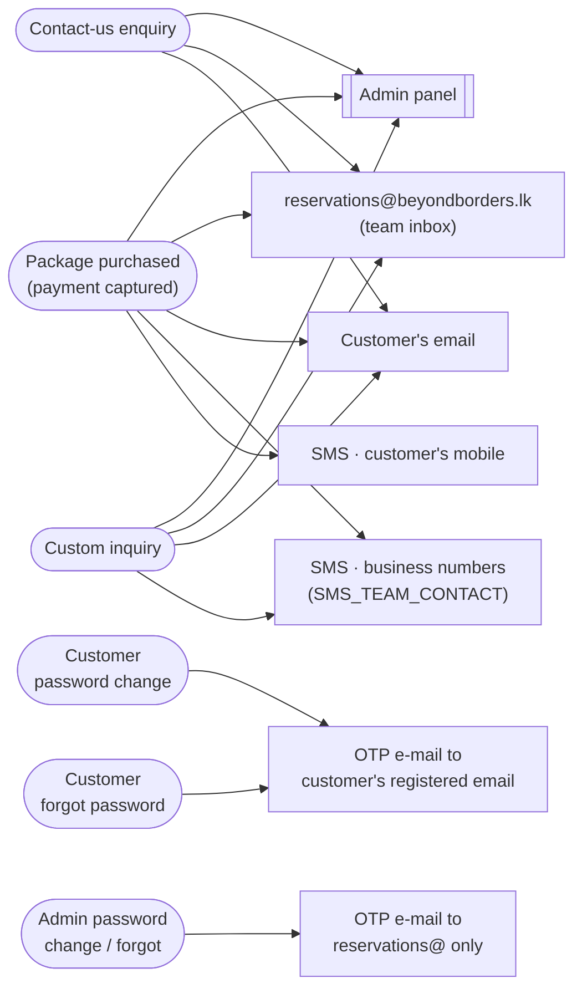

# Beyond Borders — Developer Guide

**Technical Reference & Handover for the Beyond Borders Platform**

| | |
|---|---|
| **Document** | Developer Guide |
| **Project** | Beyond Borders Website & Admin Platform |
| **Version** | v1.1 |
| **Maintained by** | Kaizen AI |
| **Prepared by** | Kaizen AI for Beyond Borders |

> **v1.1 changes:** SMS now runs on the **Dialog RichCommunication** gateway (implemented, replacing the earlier smslenz stub); a **Support panel + token-authenticated Kaizen Portal API** was added; admin content images now upload **directly to storage via signed URLs** (bypassing the serverless body-size limit); **sequential reference numbers** (`BB-ORD-####` / `BB-INQ-####`) were added; the single-active-admin handoff was re-architected as a **request queue**; branded **error boundaries** and expanded test coverage were added. Test totals and env/schema tables are updated throughout.

---

## Table of Contents

1. [Purpose & Scope](#1-purpose--scope)
2. [Architecture](#2-architecture)
3. [Tech Stack](#3-tech-stack)
4. [Folder Structure](#4-folder-structure)
5. [Local Development Setup](#5-local-development-setup)
6. [Deployment & Continuous Integration](#6-deployment--continuous-integration)
7. [Environment Variables](#7-environment-variables)
8. [Database Schema & Data Model](#8-database-schema--data-model)
9. [Security Measures](#9-security-measures)
10. [Testing & QA](#10-testing--qa)
11. [Performance & Load/Stress Testing](#11-performance--loadstress-testing)
12. [Internationalization (i18n)](#12-internationalization-i18n)
13. [Payments (MPGS / Seylan)](#13-payments-mpgs--seylan)
14. [Notifications — Email & SMS](#14-notifications--email--sms)
15. [Support Panel & Kaizen Portal API](#15-support-panel--kaizen-portal-api)
16. [Future Development Notes](#16-future-development-notes)
17. [Backup & Recovery](#17-backup--recovery)
18. [Appendix — Command & Troubleshooting Reference](#18-appendix--command--troubleshooting-reference)

---

## 1. Purpose & Scope

This guide documents the technical design of the Beyond Borders platform so that any qualified developer can understand, run, extend, and maintain it. Under the current arrangement, **Kaizen AI hosts and maintains the live system**; this document also serves as the technical reference handed to Beyond Borders for transparency and continuity.

### Ownership at a glance

- The **source code**, **hosting (Vercel)**, and **database (Supabase)** are managed by Kaizen AI on behalf of Beyond Borders under the maintenance agreement.
- The **domain** (`beyondborders.lk`) and the **payment gateway (MPGS / Seylan Bank merchant account)** are owned directly by Beyond Borders.
- Full credential details live in the separate *Ownership, Credentials & Maintenance* document and in the team password manager — **never in this repository**.

### What this platform is

A bilingual-by-design (7 languages), server-rendered marketing + booking site for a Sri Lankan luxury travel operator, plus a full staff admin panel. It supports:

- Public marketing pages (home, about, tours, destinations, destination detail pages).
- Lead capture: contact enquiries and a 4-step "custom quote" wizard (package / hotel / air ticket / transport).
- Customer accounts with **admin-approval gating** before a customer may purchase.
- Online booking and **deferred card payment** via Mastercard Payment Gateway Services (MPGS) Hosted Checkout, with **sequential human-friendly reference numbers** (`BB-ORD-####`).
- **Email + SMS notifications** (Zoho SMTP; Dialog RichCommunication SMS) on bookings, payments and inquiries.
- A staff admin panel: content CMS (packages, destinations), enquiries, custom inquiries, bookings, payments, customers, a **Support panel**, settings, and first-party web analytics.
- A **token-authenticated Support API** so an external Kaizen operations dashboard can read and update support tickets server-to-server.

---

## 2. Architecture

The platform is a modern server-rendered web application with a managed Postgres backend. Requests flow from the visitor's browser through Vercel's edge/CDN layer to the Next.js application (server components + server actions + a few route handlers), which reads and writes data in Supabase Postgres under Row-Level Security.

| Layer | Responsibility | Provider / Technology |
|---|---|---|
| **DNS & Domain** | Domain routing for `beyondborders.lk` | Registrar owned by Beyond Borders |
| **CDN / Edge / SSL** | Static asset caching, TLS termination, edge routing | **Vercel Edge Network** |
| **Hosting / App** | Serves the public site + admin app; runs server logic (SSR, server actions, route handlers, middleware) | **Vercel** (Fluid Compute, Node.js runtime) |
| **Database & Auth** | Stores packages, bookings, enquiries, customers, payments; user authentication & sessions | **Supabase / PostgreSQL** (with RLS) |
| **File Storage** | Admin-uploaded images (packages, destinations) | **Supabase Storage** (`media` public bucket) |
| **Payments** | Card payment processing | **MPGS Hosted Checkout** (Mastercard Payment Gateway Services, Seylan Bank acquirer) |
| **Email** | Transactional email (enquiry/booking notifications, pay links, receipts, OTP codes) | **Zoho SMTP** via Nodemailer + React Email |
| **SMS** | Payment + custom-inquiry notifications | **Dialog RichCommunication** SMS gateway *(implemented; gated by `SMS_ENABLED`)* |
| **Web Analytics** | First-party page views + product analytics | Self-hosted `page_views` table + **Vercel Analytics / Speed Insights** |
| **Ops integration** | Server-to-server Support-ticket API for the Kaizen dashboard | Bearer-token authenticated route handlers (`/api/support-tickets`) |

### Request flow (high level)

```
Browser
  │  HTTPS
  ▼
Vercel Edge (CDN, TLS, security headers)
  │
  ▼
Next.js App (proxy.ts middleware → next-intl locale routing + auth session refresh + /admin gate)
  │
  ├── Server Components / Server Actions ──► Supabase Postgres (RLS)
  │                                          └─► Supabase Storage (media)
  ├── Browser ──(signed upload URL)────────► Supabase Storage   (admin image upload bypasses the function body)
  ├── /api/payments/* ───────────────────► MPGS Hosted Checkout  ◄── 3DS / card capture (browser ↔ gateway iframe)
  ├── /api/support-tickets/* ◄────────────  Kaizen Portal (bearer-token, server-to-server)
  ├── /api/track ────────────────────────► page_views (first-party analytics)
  └── Email/SMS side-effects ────────────► Zoho SMTP / Dialog RichCommunication
```

**Rendering model:** Public routes are cached/static where possible; the admin app and authenticated/payment routes are dynamic (server-rendered on demand). Middleware (`proxy.ts`, exported as Next's middleware) runs on every request to handle locale routing, refresh the customer's Supabase session cookies, and gate `/admin/*`.

---

## 3. Tech Stack

Exact, current versions (from `package.json`):

| Concern | Technology | Version |
|---|---|---|
| **Framework** | Next.js (App Router, Turbopack, React Compiler) | `^16.2.9` |
| **Language** | TypeScript (strict) | `^5` |
| **UI runtime** | React / React-DOM | `^19.2.7` |
| **Styling** | Hand-authored design system in `app/globals.css` (no Tailwind) — white & gold, Soneva/Six Senses–inspired | — |
| **Backend / API** | Next.js **Server Actions** + a few **Route Handlers** under `app/api/*` | — |
| **Database** | Supabase / PostgreSQL | `@supabase/supabase-js ^2.108.1`, `@supabase/ssr ^0.12.0` |
| **Auth** | Supabase Auth (separate customer & staff/admin identities) | — |
| **i18n** | `next-intl` — 7 locales (en, ar, hi, kn, te, ur, zh), `ar`/`ur` RTL | `^4.13.0` |
| **Validation** | Zod | `^4.4.3` |
| **Email** | Nodemailer (Zoho SMTP) + React Email | `nodemailer ^9.0.1`, `@react-email/components ^1.0.12` |
| **SMS** | Dialog RichCommunication gateway (custom client in `lib/sms`, `USER`/`DIGEST`=MD5/`CREATED` auth) | — (built on `node:crypto`, no SDK) |
| **Payments** | MPGS Hosted Checkout (custom client in `lib/payments`) | — |
| **Motion / UX** | `motion` (Framer Motion successor) + `lenis` smooth scroll | `motion ^12.40.0`, `lenis ^1.3.23` |
| **Reference data** | airport codes, airline codes, country/state/city pickers | `@nwpr/airport-codes`, `airline-codes`, `country-state-city` |
| **Analytics** | Vercel Analytics + Speed Insights | `@vercel/analytics ^2.0.1`, `@vercel/speed-insights ^2.0.0` |
| **Package manager** | npm | — |
| **Node version** | **Node.js 24** locally; **Node.js 22** in CI and recommended on Vercel | — |

### Testing & tooling stack

| Concern | Technology | Version |
|---|---|---|
| Unit / component / integration | **Vitest** + Testing Library + jsdom | `vitest ^4.1.8`, `@testing-library/react ^16.3.2` |
| Coverage | `@vitest/coverage-v8` | `^4.1.9` |
| End-to-end / browser | **Playwright** | `@playwright/test ^1.60.0` |
| Accessibility | `@axe-core/playwright` | `^4.12.1` |
| Linting | ESLint + `eslint-config-next` + `eslint-plugin-react-hooks` (React Compiler rules) | `eslint ^9.39.4` |
| Type checking | `tsc --noEmit` | — |
| Security audit | Custom static auditor (`tests/security/audit.mjs`) + `npm audit` | — |
| Perf profiling | `react-scan` | `^0.5.7` |
| Scripts runner | `tsx` | `^4.22.4` |

---

## 4. Folder Structure

```
beyond-borders-next/
├── app/                          # Next.js App Router
│   ├── [locale]/                 # Public, localized site (7 languages)
│   │   ├── page.tsx              # Home
│   │   ├── about/  tours/  destinations/  contacts/
│   │   ├── [slug]/               # Destination detail pages
│   │   ├── booking/[slug]/       # Per-package booking page
│   │   ├── custom-quote/         # 4-step custom inquiry wizard (+ actions.ts)
│   │   ├── account/              # Customer dashboard (+ actions, password-actions)
│   │   ├── login/  register/  forgot-password/  reset-password/
│   │   ├── pay/[token]/          # Deferred payment link → MPGS hosted checkout
│   │   └── terms/
│   ├── admin/                    # Staff panel (English-only, NOT under [locale])
│   │   ├── login/ (+ waiting/)   # Single-active-admin login + handoff
│   │   ├── forgot-password/  reset-password/
│   │   ├── packages/ (+ [id], new)      # Package CMS
│   │   ├── destinations/ (+ [id], new)  # Destination CMS
│   │   ├── enquiries/ (+ [id])
│   │   ├── custom-inquiries/ (+ [id])
│   │   ├── bookings/ (+ [id])
│   │   ├── users/                # Customers: verify / activate / deactivate
│   │   ├── support/              # Support panel: ticket CRUD (KZN-#### numbers)
│   │   ├── settings/             # Admin password change, etc.
│   │   ├── _components/          # AdminPresence, MediaUploadField, DirtySubmitButton…
│   │   ├── error.tsx             # Admin error boundary (branded, recoverable)
│   │   └── actions.ts            # Admin server actions (+ signed-upload-URL action)
│   ├── api/
│   │   ├── admin/{login,session}/      # Admin login + single-session handoff polling
│   │   ├── support-tickets/ (+ [id])   # Token-authenticated Kaizen Portal API
│   │   ├── payments/{create-session,webhook}/   # MPGS session + notifications
│   │   ├── track/                # First-party analytics beacon
│   │   ├── cities/  places/      # Reference-data lookups for forms
│   ├── [locale]/error.tsx        # Public error boundary (branded, recoverable)
│   └── actions.ts                # Public enquiry + booking server actions
├── components/                   # Reusable UI (Header, Footer, forms, DatePicker, Select…)
│   └── account/
├── lib/
│   ├── data/                     # Supabase-backed data access (packages, bookings, analytics, rate-limit, reference-numbers, support-tickets…)
│   ├── supabase/                 # server / service-role / public client factories
│   ├── auth/                     # password-reset (OTP) logic
│   ├── admin/                    # admin auth, single-active-session queue, direct-upload helper
│   ├── customer/                 # customer auth guards (requireCustomer / requireVerifiedCustomer)
│   ├── api/                      # support-api bearer-token authorizer
│   ├── validation/               # Zod schemas (admin, account, custom-inquiry, support…)
│   ├── payments/                 # MPGS client, reconcile, currency helpers
│   ├── email/ (+ templates/)     # Nodemailer transport + React Email templates
│   ├── sms/                      # Dialog RichCommunication client + send helpers
│   ├── security/                 # IP hashing, rate-key scoping, retry-after
│   ├── format/                   # price/date formatting
│   ├── i18n/                     # i18n helpers
│   └── env.ts                    # Centralized, server-only env access
├── i18n/                         # next-intl routing & request config
├── messages/                     # Translation catalogs: en, ar, hi, kn, te, ur, zh (.json)
├── supabase/migrations/          # SQL schema, RLS policies, RPCs, Storage bucket
├── scripts/                      # seed, load test, image optimization, codegen, SMS/email verify
├── tests/                        # unit / component / integration / e2e / security  (see §10)
├── public/                       # static assets (brand, images, flags)
├── proxy.ts                      # Next.js middleware (locale routing + session + /admin gate)
├── next.config.ts                # security headers / CSP, image domains, next-intl plugin
├── playwright.config.ts          # E2E projects (chromium + authed-admin + authed-customer)
├── vitest.config.ts              # unit/component config
├── vitest.integration.config.ts  # integration (test-DB) config
└── .github/workflows/ci.yml      # CI gate
```

---

## 5. Local Development Setup

**Prerequisites:** Node.js 22+ (24 is used locally), npm, and access to the Supabase project (or a local `supabase start` stack).

```bash
# 1. Install dependencies
npm install

# 2. Configure environment
cp .env.example .env        # then fill in real values (see §7)

# 3. Run the dev server (Turbopack)
npm run dev                 # http://localhost:3000
```

To seed content into a fresh database:

```bash
supabase start             # optional: local Supabase stack
npm run seed               # loads destinations + packages (scripts/seed.ts)
```

> **Local-dev gotchas (learned in this project):**
> - When testing the **admin** panel locally, use `http://localhost:3000`, **not** `http://127.0.0.1:3000` — the admin session cookie is host-scoped and the two hosts don't share it.
> - Keep Supabase **email confirmation OFF**. Registration creates the auth user server-side and gates purchasing via the admin-approval `verified` flag; turning on Supabase's own email confirmation breaks the registration flow.
> - Payments are gated by `PAYMENTS_ENABLED`. With it `false`, the booking flow still works but the pay step is inert.

---

## 6. Deployment & Continuous Integration

### Hosting / deploy

Deployment is automated through Vercel's Git integration.

| Branch | Environment | Behaviour |
|---|---|---|
| `master` | **Production** | Auto-deploys to the live site on push/merge. |
| `feature/*` (any non-default branch) | **Preview** | Each push creates a disposable preview URL. |

**Deployment rules of thumb**

- **Never commit secrets.** All environment variables are configured in the Vercel dashboard (and locally in `.env`, which is git-ignored). The static security audit (§9/§10) enforces that `.env*` files are never committed.
- **Database schema changes go through migrations** in `supabase/migrations/`, never by hand-editing production tables. Migrations are timestamp-versioned and additive/idempotent where possible.
- **Promote / rollback** via the Vercel dashboard: each deploy is immutable; rolling back is "promote a previous deployment to production." No code change is required to roll back.
- After changing SMTP or MPGS env in Vercel, **redeploy** so the new values take effect (a known fix for the Zoho 553 "relay" issue was to overwrite the Vercel SMTP env from local and redeploy).

### Continuous Integration (`.github/workflows/ci.yml`)

Runs on **every push and pull request** (Ubuntu, Node 22):

```
npm ci
npm audit --omit=dev --audit-level=high   # fail on high/critical prod vulns
npm run lint                              # ESLint
npm run typecheck                         # tsc --noEmit
npm run test                              # Vitest (unit + component)
npm run build                             # production build must succeed
```

For the **full** production-readiness gate (adds integration, security audit, and the Playwright E2E/a11y/SEO/perf suite), run locally:

```bash
npm run test:all       # tests/run-all.mjs — every layer in sequence, single summary
```

---

## 7. Environment Variables

Actual secret values are **not** stored in this document — they live in Vercel and the team password manager. `.env.example` is the canonical, commented reference. Centralized, server-only access is via `lib/env.ts` (which imports `server-only`, so it can never be bundled to the client).

| Variable | Purpose | Where set | Secret |
|---|---|---|---|
| `NEXT_PUBLIC_SUPABASE_URL` | Supabase project URL | Vercel + `.env` | No |
| `NEXT_PUBLIC_SUPABASE_ANON_KEY` | Public/anon Supabase key (client) | Vercel + `.env` | No |
| `SUPABASE_SERVICE_ROLE_KEY` | Server-side privileged key — **bypasses RLS** | **Vercel only / server only** | **YES** |
| `SUPABASE_PROJECT_ID` | Project ref for `supabase gen types` | Vercel + `.env` | No |
| `NEXT_PUBLIC_SITE_URL` | Base URL for return URLs / pay links / SEO | Vercel + `.env` | No |
| `ADMIN_ALLOWED_EMAILS` | Comma-separated staff allowlist (bootstraps admin profiles, gates admin OTP) | Vercel + `.env` | No |
| `SMTP_HOST` / `SMTP_PORT` | Zoho SMTP host/port (465 SSL or 587 STARTTLS) | Vercel + `.env` | No |
| `SMTP_USER` / `SMTP_PASSWORD` | Zoho mailbox + **app-specific password** | Vercel only | **YES** (password) |
| `EMAIL_FROM` / `EMAIL_TEAM_INBOX` | From-address + staff inbox | Vercel + `.env` | No |
| `PAYMENTS_ENABLED` | Master switch for the payment flow | Vercel + `.env` | No |
| `MPGS_BASE_URL` | Gateway base (test = `test-seylan.mtf…`; **swap for prod**) | Vercel + `.env` | No |
| `MPGS_API_VERSION` | MPGS API version (`100`) | Vercel + `.env` | No |
| `MPGS_MERCHANT_ID` | Merchant ID | Vercel only | sensitive |
| `MPGS_API_PASSWORD` | Gateway API password | **Vercel only / server only** | **YES** |
| `MPGS_MERCHANT_NAME` | Display name on checkout | Vercel + `.env` | No |
| `MPGS_CURRENCY` | Settlement currency — **`USD`** (gateway settles in USD) | Vercel + `.env` | No |
| `USD_TO_LKR_RATE` | Legacy conversion rate (fallback util only; unused while settling in USD) | Vercel + `.env` | No |
| `MPGS_WEBHOOK_SECRET` | Notification secret for webhook verification | **Vercel only** — never committed/pushed | **YES** |
| `PAY_LINK_TTL_HOURS` | Pay-link lifetime (default 72h) | Vercel + `.env` | No |
| `SMS_ENABLED` | Master switch for SMS | Vercel + `.env` | No |
| `SMS_BASE_URL` | Dialog endpoint (default `https://richcommunication.dialog.lk/api/sms/send`) | Vercel + `.env` | No |
| `SMS_USERNAME` | Dialog gateway username (`USER` header) | Vercel only | sensitive |
| `SMS_PASSWORD` | Dialog password — sent **MD5-hashed** as the `DIGEST` header, never in clear | **Vercel only / server only** | **YES** |
| `SMS_MASK` | Registered sender mask / sender name (e.g. `BB Tours SL`) | Vercel + `.env` | No |
| `SMS_TEAM_CONTACT` | Business mobile that receives payment/inquiry alerts | Vercel + `.env` | No |
| `SMS_API_KEY` | Reserved (Dialog auth uses username + MD5 digest; not required for send) | Vercel only | sensitive |
| `SUPPORT_API_KEY` | Shared bearer secret for the Kaizen Portal Support API. Unset ⇒ API returns `503` | **Vercel only / server only** | **YES** |
| `UPSTASH_REDIS_REST_URL` / `_TOKEN` | Reserved for a future Redis-backed limiter (not wired; DB limiter is used instead) | — | — |

**Security discipline**

- Anything prefixed `NEXT_PUBLIC_` is exposed to the browser — **never** put a secret behind that prefix.
- The Supabase **service-role key**, **MPGS API password**, **webhook secret**, **SMS password**, and **`SUPPORT_API_KEY`** are highly sensitive and must exist **server-side only**. A static audit (§9) fails the build if a `"use client"` file references the service-role key.
- `.env.example` is a **template** — keep placeholder values in it; never paste a real secret (e.g. a real `SUPPORT_API_KEY`) into the committed example.

---

## 8. Database Schema & Data Model

Backend is **Supabase / PostgreSQL** with **15 tables**, all under Row-Level Security, plus two sequences and a set of `SECURITY DEFINER` RPCs. Migrations live in `supabase/migrations/` (**16 timestamp-versioned migrations**, additive/idempotent). The data-access layer is in `lib/data/`, `lib/auth/`, `lib/admin/`, `lib/customer/`.

### Enumerated types

| Enum | Values |
|---|---|
| `content_status` | `draft`, `published` |
| `enquiry_status` | `new`, `contacted`, `closed` |
| `booking_status` | `new`, `confirmed`, `awaiting_payment`, `paid`, `cancelled` |
| `payment_status` | `initiated`, `pending`, `captured`, `failed`, `refunded` |
| `custom_inquiry_type` | `package`, `hotel`, `airticket`, `transport` |
| `staff_role` | `admin` |

### Tables (purpose + key columns)

**Content (public-readable when published):**

- **`destinations`** — destination content. `id`, `slug` (unique), `title`, `tagline`, `summary`, `highlights[]`, `hero_image`, `card_image`, `status`, `sort_order`, `translations` (JSONB, per-locale).
- **`tour_packages`** — tour packages. `id`, `slug` (unique), `title`, `tier`, `hotels`, `duration`, `inclusions[]`, `price_amount numeric(12,2)`, `currency` (default `LKR`; new packages default to `USD` via the app), `deposit_amount`, `status`, `sort_order`, `translations`.
- **`itinerary_items`** — day-by-day itinerary, FK `tour_package_id → tour_packages(id)` `ON DELETE CASCADE`. `day_label`, `title`, `description`, `sort_order`, `translations`.
- **`site_settings`** — global key/value (`key` unique, `value` JSONB). Public-readable; admin-writable.

**Lead capture (admin-readable only):**

- **`enquiries`** — contact-form submissions. `name`, `email`, `phone`, `message`, `status`, `source`, `ip_hash`.
- **`custom_inquiries`** — multi-type quote wizard. `inquiry_type`, `first_name`, `last_name`, `country_city`, `passport_number`, `email`, `mobile`, `details` (JSONB — type-specific fields), `reference` (`BB-INQ-####`), `status`, `ip_hash`.

**Support (admin-readable; also read/updated by the token-authenticated Portal API):**

- **`support_tickets`** — internal support tickets raised from the admin Support panel. `id`, `number` (unique `KZN-####`, random-but-unique via a 23505 retry loop), `title`, `description`, `image_url` (optional screenshot in the `media` bucket), `status` (`open` → `in_progress` → `closed`, `CHECK`-constrained), `created_at`, `updated_at`. **Status is only ever changed by the Kaizen Portal API**, never from the Beyond Borders admin UI.

> **Sequential reference numbers:** `bookings.reference` carries a human-friendly `BB-ORD-####`, and `custom_inquiries.reference` carries `BB-INQ-####` — both drawn from Postgres **sequences** (`order_number_seq`, `inquiry_number_seq`, starting at 1000) via `SECURITY DEFINER` RPCs. This gives staff and customers stable, readable IDs (shown on emails, SMS and the admin panel) instead of raw UUIDs, while guaranteeing uniqueness under concurrency. The app **falls back to a random suffix** if the sequence RPC is unavailable, so a lead/booking is never blocked.

**Booking & payment:**

- **`bookings`** — `reference` (unique, `BB-ORD-####`), FK `tour_package_id`, `traveller_name`, `email`, `phone`, `travel_dates`, `travellers (>0)`, `status`, `quoted_amount`, `currency`, `ip_hash`, `user_id` (FK `auth.users`, links the customer who booked).
- **`payments`** — FK `booking_id → bookings(id)` `ON DELETE CASCADE`. `mpgs_order_id` (unique), `mpgs_session_id`, `mpgs_transaction_id`, `amount (>0)`, `currency`, `status`, `pay_token` (unique), `pay_token_expires_at`, `gateway_result` (JSONB audit of the full gateway response).

**Identity:**

- **`profiles`** — staff/admin. `id` = `auth.users(id)`, `role` (`admin`), `full_name`.
- **`customers`** — end-user accounts. `id` = `auth.users(id)`, `full_name`, `first_name`, `last_name`, `email`, `phone`, `country`, `city`, `date_of_birth`, `passport_number`, `passport_expiry`, **`verified`** (admin-approval gate for purchasing), `verified_at`, **`active`** (login enable/disable, independent of `verified`). Unique index on `lower(email)`.

**Operational / service-role-only (RLS enabled, *no* policies — zero access for anon/authenticated):**

- **`rate_limit_events`** — sliding-window limiter ledger. `action`, `ip_hash`, `created_at`.
- **`password_reset_codes`** — OTP reset. `email`, `user_id`, `audience` (`customer`/`admin`), `code_hash` (salted SHA-256 — plaintext never stored), `expires_at`, `attempts`, `consumed_at` (single-use).
- **`page_views`** — first-party analytics. `path`, `visitor_hash` (salted IP hash — no raw IP, no cookies), `referrer`, `country`.
- **`admin_login_lock`** — *legacy.* An earlier single-row implementation of the single-active-admin seat. The seat + handoff now lives entirely in the admin user's `user_metadata.admin_session` (a request **queue** — see §9.2), so this table is no longer read/written by the app; it remains only so old migrations apply cleanly and can be dropped in a future cleanup migration.

### Functions, triggers & RPCs

- `set_updated_at()` — trigger on all content/identity tables; stamps `updated_at = now()` on UPDATE.
- `is_admin()` — `SECURITY DEFINER`; true when `auth.uid()` is an `admin` in `profiles`. Used throughout RLS.
- `is_verified_customer()` — `SECURITY DEFINER`; true when `auth.uid()` is a `verified` customer.
- `analytics_summary(days)`, `analytics_top_pages(days, max)`, `analytics_daily(days)` — `SECURITY DEFINER`, `STABLE`, `EXECUTE` granted to `service_role` only; power the admin dashboard.
- `next_order_number()` / `next_inquiry_number()` — `SECURITY DEFINER`; return the next value from `order_number_seq` / `inquiry_number_seq` for the `BB-ORD-####` / `BB-INQ-####` references. `EXECUTE` granted to `service_role` only.
- `acquire_admin_login_lock(user_id, email, expires_at)` — *legacy* (see `admin_login_lock` above); retained but no longer called.

### Storage

- **`media`** (public bucket) — admin-uploaded package/destination images. Policies: **public read**; **admin-only** insert/update/delete (`bucket_id = 'media' AND is_admin()`). The Supabase Storage host is whitelisted in `next.config.ts` `images.remotePatterns` so the Next image optimizer can serve uploads (otherwise pages rendering an uploaded image crash).

### RLS access model (summary)

| Table | SELECT | INSERT | UPDATE | DELETE |
|---|---|---|---|---|
| destinations / tour_packages / itinerary_items | published **or** admin | admin | admin | admin |
| site_settings | public (all) | admin | admin | admin |
| enquiries / custom_inquiries | admin | service role¹ | admin | — |
| bookings | own (`user_id = auth.uid()`) **or** admin | service role¹ | admin | — |
| payments | own booking (customer) **or** admin | admin² | admin | — |
| customers | own **or** admin | self (`id = auth.uid()`) | admin | admin |
| profiles | own **or** admin | admin | admin | admin |
| support_tickets | admin | admin | admin | *(service role — Portal API; no RLS delete policy)* |
| rate_limit_events / password_reset_codes / page_views / admin_login_lock | **service role only** (RLS on, no policies) | service | service | service |

> ¹ Anonymous public submissions are written by the **service-role** client (RLS-exempt), then read by staff under RLS. ² Admins insert `payments` when generating a pay link; machine writes (create-session, reconcile) use the service role.

**Entity relationships:** `tour_packages 1—* itinerary_items`, `tour_packages 1—* bookings`, `bookings 1—* payments`, `auth.users 1—1 {profiles | customers}`, `auth.users 1—* bookings` (via `user_id`).

---

## 9. Security Measures

Security is layered: HTTP headers at the edge, authentication & authorization in middleware + page guards, RLS at the database, validation at every input boundary, and abuse controls (rate limiting + anti-spam) on every public write.

### 9.1 HTTP security headers (`next.config.ts`)

Applied to **all** routes (`source: "/:path*"`):

| Header | Value |
|---|---|
| `Strict-Transport-Security` | `max-age=63072000; includeSubDomains; preload` (2 years) |
| `X-Frame-Options` | `DENY` |
| `X-Content-Type-Options` | `nosniff` |
| `Referrer-Policy` | `strict-origin-when-cross-origin` |
| `Permissions-Policy` | `camera=(), microphone=(), geolocation=(), browsing-topics=()` |
| `Content-Security-Policy` | see below |

**Content-Security-Policy** (origins for MPGS and Supabase are derived from env):

```
default-src 'self';
base-uri 'self';
object-src 'none';
frame-ancestors 'none';
form-action 'self';
script-src 'self' 'unsafe-inline' <MPGS_ORIGIN> https://*.gateway.mastercard.com https://va.vercel-scripts.com;
style-src 'self' 'unsafe-inline';
img-src 'self' data: blob: https:;
font-src 'self' data:;
connect-src 'self' <SUPABASE_ORIGIN> https://*.supabase.co wss://*.supabase.co <MPGS_ORIGIN> https://*.gateway.mastercard.com https://va.vercel-scripts.com https://vitals.vercel-insights.com;
frame-src 'self' <MPGS_ORIGIN> https://*.gateway.mastercard.com;
```

Notes: `'unsafe-inline'` is required for Next's framework inline scripts/styles (no nonce pipeline); `'unsafe-eval'` is added **only in dev** for Fast Refresh. The Mastercard gateway host (`frame-src` / `script-src`) and Supabase (`connect-src`, incl. `wss:` for realtime) are the only third parties. `frame-ancestors 'none'` + `X-Frame-Options: DENY` make the site un-iframeable (anti-clickjacking).

> **Go-live check:** validate the CSP in a real browser across the **live** payment flow before launch — `MPGS_BASE_URL` must point at the **production** Seylan gateway (not `test-seylan.mtf…`), or checkout is silently blocked.

### 9.2 Authentication

- **Supabase Auth** backs two distinct identities sharing one `auth.users` table:
  - **Customers** — self-register (`customers` row, `verified = false`, `active = true`). They can sign in immediately to see their pending status but **cannot purchase** until an admin sets `verified = true`.
  - **Staff/admins** — bootstrapped from `ADMIN_ALLOWED_EMAILS`; on first login a `profiles` row (`role = admin`) is created. Admin identity is checked against the allowlist, not self-service.
- **Session refresh** happens in middleware (`proxy.ts` → `refreshCustomerSession`): the only place that can write rotated auth cookies back to the browser, so a returning customer isn't silently logged out when the short-lived access token expires.
- **Sign-out uses `scope: 'local'`** deliberately — a global sign-out would invalidate the shared admin account's other sessions. (See single-active-admin below.)
- **Single-active-admin seat + interactive handoff:** one shared admin account is coordinated entirely in the admin user's `user_metadata.admin_session`. Each browser gets a random session id (`admin_sid` httpOnly cookie); the metadata holds the current seat holder plus a **queue of pending login requests** (one per contesting session). A new login either claims a free/expired seat, renews its own, or **enqueues a pending request** the current holder resolves on the `/admin/login/waiting` handoff screen. Because it's a queue (not a single slot), **multiple people contesting at once no longer clobber each other's request** — a real bug that previously deadlocked the handoff. Decisions are batch-aware: **"Keep my session" denies every waiting request at once**, and **"Allow" hands the seat to the first (oldest) requester and denies the rest** in one click. Liveness is a lease (active ≈ 60s, refreshed via heartbeat on each admin request/poll; login requests expire ≈ 120s), it **self-heals** a lost metadata write by re-registering on the next poll, and all seat logic **fails open** so an internal error never locks staff out. Sign-out uses `scope:'local'` so resolving the seat never invalidates the shared account's other tokens. *(The legacy `admin_login_lock` table is no longer used — see §8.)*

### 9.3 Authorization & route protection

- **Middleware (`proxy.ts`)** gates `/admin/*`: no Supabase user → redirect to `/admin/login`. (Admin is English-only, outside the `[locale]` tree.)
- **Page-level guards** in `lib/customer/auth.ts` and `lib/admin/auth.ts`:
  - `requireCustomer()` → redirect to `/login` if not signed in.
  - `requireVerifiedCustomer()` → redirect to `/account` (pending state) if signed in but not yet verified — this is what hides the booking form from unverified customers.
  - `requireAdmin()` → resolves the admin, **heartbeats** the single-session seat, and redirects to `/admin/login` (with a "superseded" signal) if the seat was taken over.
- **Database RLS** is the final backstop: even if a guard were bypassed, the policies in §8 prevent reading enquiries/bookings/payments/customers without `is_admin()`, and scope customers to their own rows.

### 9.4 Rate limiting (DB-backed sliding window)

`lib/data/rate-limit.ts` → `checkAndRecordRateLimit(action, ipHash, { max, windowMinutes })` counts rows in `rate_limit_events` for `(action, ip_hash)` within the window, records the attempt, and reports `allowed` + an accurate `retryAfterSeconds` (computed from when the oldest counted attempt ages out). It is **fail-open**: any error (including the table not existing yet) logs and **allows** the request, so a limiter fault can never lock real users out.

**Per-action limits in force:**

| Action | Max | Window | Keyed by |
|---|---|---|---|
| `enquiry` (contact form) | 5 | 60 min | IP |
| `booking` | 10 | 60 min | IP |
| `custom-inquiry` | 8 | 60 min | IP + email |
| `register` | 5 | 60 min | IP + email |
| `login` | 10 | 15 min | IP + email |
| `password-reset-request` | 5 | 30 min | IP + email |
| `password-reset-verify` | 10 | 15 min | IP + email |
| `customer-password-change-otp` | 5 | 30 min | IP + email |
| `customer-password-change` | 10 | 15 min | IP + email |
| `admin-password-reset-request` | 5 | 30 min | IP + email |
| `admin-password-reset-verify` | 10 | 15 min | IP + email |
| `admin-password-change-otp` | 5 | 30 min | IP + email |
| `admin-password-change` | 10 | 15 min | IP + email |
| `create-session` (payment) | 20 | 10 min | IP |

A second, **in-memory** fixed-window limiter (`lib/security/ip-rate-limit.ts`, `makeIpRateLimiter`) guards the high-frequency typeahead endpoints `/api/places` and `/api/cities` (which fire per keystroke). It's per-warm-instance, per-IP, capped at `MAX_KEYS = 5000` entries (evicts oldest to bound memory), and fail-open.

**Per-(IP, account) scoping** (`scopedRateKey`, `lib/security/request.ts`): account-bound actions hash `ipHash : email` so users behind a **shared/CGNAT IP** (office Wi-Fi, mobile) each get their own window per account — one person's attempts can't lock everyone else out, while brute-forcing a single account is still throttled. (This fixed an earlier multi-hour shared-IP lockout caused by IP-only keying.)

**IP hashing** (`getRequestIpHash`): prefers the platform-set `x-real-ip` over the left-most `x-forwarded-for` (which a client can spoof to rotate keys), then stores only `SHA-256(ip : service_role_key)`. With no platform IP it uses a **deterministic shared `"unknown"` bucket** (not a random one — random would silently disable the per-IP caps).

### 9.5 Anti-spam on public forms

Every public write form (contact, booking, custom quote) carries two invisible defenses:

- **Honeypot** — a hidden `company` field (`tabIndex={-1}`, `autoComplete="off"`); if a bot fills it, the submission is dropped.
- **Time-trap** — a hidden `startedAt` timestamp; submissions completed in **under 2.5 seconds** (`Date.now() - startedAt >= 2500`) are rejected as automated.

These run **before** any DB write or email send, in addition to the rate limits and per-IP volume counts (`countRecent*ByIp`).

### 9.6 Input validation

All form input is validated server-side with **Zod** schemas in `lib/validation/` (`account.ts`, `enquiry.ts`, `booking.ts`, `custom-inquiry.ts`, `admin.ts`, `air-segments.ts`) before any persistence — server actions `.safeParse()` and return field-level errors without throwing. Coverage includes:

- **Email** — `z.email()` + length cap, plus a **deliverability check** (`lib/validation/email-deliverability.ts`) that verifies MX/A records and blocks reserved domains/TLDs (`.test`, `.example`, `.invalid`, `.localhost`, `example.com`…) so QA addresses never reach the production SMTP.
- **Passwords** — min 8 / max 200 chars, with confirmation-match refinements on register and reset.
- **Dates** — ISO `YYYY-MM-DD`; future-only passport expiry, no past travel dates, return ≥ departure, future-DOB rejection on registration.
- **Numbers / enums** — coerced with bounds (e.g. travellers/rooms 1–50), trip-type and status enums.
- **Cross-field refinements** — e.g. flight origin ≠ destination; round-trip return-date logic.

### 9.7 Payment security

- **MPGS Hosted Checkout** — card data is entered in the gateway's own hosted fields/iframe (PCI scope stays with the gateway, not the app). The app never sees raw PAN/CVC.
- **Pay tokens** — each payment gets a unique, unguessable `pay_token` (**32 random bytes / 256-bit, base64url**, via `crypto.randomBytes`) with a server-set expiry (`pay_token_expires_at`, default 72h via `PAY_LINK_TTL_HOURS`). Expired links render an "expired" state (HTTP 410 on the session endpoint); the token is the only handle exposed in the `/pay/<token>` URL.
- **CSRF / same-origin guard** — `/api/payments/create-session` mutates payment state, so it rejects cross-site callers: the request `Origin` host must equal the `Host` header (a missing Origin, i.e. non-browser, is allowed). It is also rate-limited (20 / 10 min / IP) and returns `429` with `Retry-After` when exceeded.
- **Webhook verification** — gateway notifications hit `/api/payments/webhook` and are verified against `MPGS_WEBHOOK_SECRET` (kept out of the repo entirely) using a **timing-safe** comparison (`crypto.timingSafeEqual`); it **fails closed** (401) on any mismatch, yet returns `200` for an unknown order so the endpoint can't be used to probe for valid order IDs.
- **Reconciliation** (`lib/payments/reconcile.ts`) is the source of truth for moving a payment to `captured` and a booking to `paid`. It is **idempotent and concurrency-safe** — both the webhook and the customer's return page call it, but a guarded update (`.neq("status","captured")`) ensures only one transition fires the receipt email/SMS. Receipt/SMS sends are fail-soft.
- The full gateway response is archived in `payments.gateway_result` (JSONB) for audit.

### 9.8 Password reset (OTP)

`lib/auth/password-reset.ts`:

- A **6-digit numeric code** is emailed; only a **salted SHA-256 hash** (code + email + service-role-key salt) is stored in `password_reset_codes`. Plaintext is never persisted, and verification uses a **timing-safe** hex comparison.
- Codes are **single-use** (`consumed_at`), **short-lived** (15 min, `OTP_TTL_MINUTES`), and **attempt-throttled** (max **5** wrong guesses per code, `MAX_VERIFY_ATTEMPTS`). Issuing a new code invalidates earlier ones; a successful reset burns the code and its siblings.
- **No account enumeration:** requesting a reset for an unknown / non-allowlisted email returns the same "if an account exists, a code was sent" response and sends nothing.
- **Audience separation:** admin resets (`audience = 'admin'`) require the email to be in `ADMIN_ALLOWED_EMAILS` and deliver the code to the **admin security inbox** (`reservations@beyondborders.lk`), not to an arbitrary typed address; customer resets (`audience = 'customer'`) email the customer's own address.

### 9.9 Secrets & data-handling discipline

- `lib/env.ts` imports `server-only` — server secrets can't leak into a client bundle.
- The static auditor (`tests/security/audit.mjs`, see §10) fails on: high/critical prod dependency vulns, committed `.env*` files, hardcoded private keys / JWTs / API secrets, any `"use client"` file referencing the service-role key, and `eval()` / `new Function()` usage; it warns on `dangerouslySetInnerHTML`.
- **Privacy:** analytics store only a **salted IP hash** (no raw IP, no cookies, no PII) — `page_views.visitor_hash`. Rate-limit and analytics tables are service-role-only.
- A reserved-email guard (`isReservedEmailDomain`) skips outbound mail to `*.test` addresses so QA never emails real inboxes.

### 9.10 Authenticated Portal API (`/api/support-tickets`)

The Kaizen operations dashboard reads/updates support tickets server-to-server through a small, hardened API (`lib/api/support-auth.ts` → `authorizeSupportApi`):

- **Shared-secret bearer token** (`Authorization: Bearer <SUPPORT_API_KEY>`). The key is **server-only** and never shipped to any browser.
- **Constant-time comparison:** the presented token and the expected key are each hashed with **SHA-256** and compared via **`crypto.timingSafeEqual`** — the equal-length hashes prevent both timing side-channels and length leakage.
- **Fails closed:** a missing/malformed header or wrong key returns **`401`**; if `SUPPORT_API_KEY` is unset the API returns **`503`** (disabled) rather than allowing through.
- **Least privilege:** only the ticket endpoints are exposed. Reads/updates use the service-role client *behind* the token check; the browser never has ticket write access. `PATCH` accepts **only** the status field, validated against the `open`/`in_progress`/`closed` enum — the Portal can move a ticket's lifecycle but nothing else. All responses are `no-store`.

### 9.11 Direct-to-storage uploads (signed URLs)

Admin package/destination images upload **straight from the browser to Supabase Storage**, not through the Server Action body:

- A tiny **admin-gated** server action (`createMediaUploadUrlAction`) validates the file's declared **type and size (≤ 8 MB)** and mints a short-lived **signed upload URL** (service role) pinned to a random path under a fixed prefix (`destinations/` or `packages/`).
- The browser `PUT`s the bytes to that signed URL (anon client, `uploadToSignedUrl`); the form then submits **only the resulting public URL**.
- **Why it matters:** image bytes never transit the serverless function, so the platform's **~4.5 MB request-body limit can't break a multi-image save** (a real bug when changing both card + hero at once), the payload stays tiny, and the signed URL grants write access to exactly one path for a short window — no broad browser upload permission.

### 9.12 Graceful failure & error boundaries

- **Branded error boundaries** on both the public site (`app/[locale]/error.tsx`) and the admin panel (`app/admin/error.tsx`): an unexpected server error renders a recoverable "we hit a snag / try again" page in-shell instead of a raw Next.js stack trace — no internal details leak to visitors.
- **Structured, fail-soft server actions:** public and admin form actions wrap DB/email/SMS/storage work and return typed `{ ok, note }` results the UI surfaces inline; notifications (email/SMS) are **best-effort** and never block or fail the primary action.
- Payment **reconciliation is idempotent** and the webhook returns `200` for unknown orders (no probing) — see §9.7.

---

## 10. Testing & QA

The project ships with a deep, multi-layer automated suite plus a documented manual/UAT process. The single command **`npm run test:all`** runs every layer in sequence and prints one pass/fail summary (`tests/run-all.mjs`).

### 10.1 Test layers & counts

| Layer | Tool | Location | Count | What it covers |
|---|---|---|---|---|
| **Type check** | `tsc --noEmit` | whole repo | — | strict TypeScript correctness |
| **Lint** | ESLint (+ React Compiler hook rules) | whole repo | — | code quality; blocks `setState`-in-effect & ref-access-in-render |
| **Unit** | Vitest | `tests/unit/` | **111 tests** across 17 files | validation, dates, formatting, rate-key/IP, retry-after, payment currency, payment tokens, reconcile, security utils, i18n localize, SMS, email deliverability, **single-active-admin handoff queue** |
| **Component** | Vitest + Testing Library | `tests/component/` | **34 tests** across 10 files | ContactForm, BookingRequestForm, CustomInquiryForm, Combobox, PasswordInput, PayButton, StatusBadge, Toast, TourPackageList |
| **Integration** | Vitest (test DB) | `tests/integration/` | **14 tests** across 3 files | **RLS policies**, password-reset flow end-to-end, data + analytics RPCs |
| **Security audit** | custom Node script | `tests/security/audit.mjs` | 5 check groups | deps, committed secrets, hardcoded secrets, service-key leakage, dangerous patterns |
| **E2E / browser** | Playwright (Chromium) | `tests/e2e/` | **44 tests** across 13 specs | full user journeys, responsiveness, accessibility, SEO, performance, security headers |

**Totals: 159 Vitest tests (111 unit + 34 component + 14 integration) and 44 Playwright E2E tests — 203 automated tests**, plus the static security audit and the `tsc`/ESLint gates.

The **admin-handoff** suite (`tests/unit/admin-session.test.ts`) deserves a call-out: it exercises the real session logic against an in-memory metadata store and proves the properties that were previously broken — two contenders' requests coexist without clobbering, "Allow" actually takes (not `"invalid"`), the first requester wins and the rest are denied, one "Keep my session" denies the whole batch, and a lost metadata write self-heals.

### 10.2 What the E2E suite verifies (`tests/e2e/`)

Playwright runs three projects: a public **chromium** project, an **authed-admin** project (pre-authenticated via `auth.setup.ts` → `tests/.auth/admin.json`), and an **authed-customer** project.

- `smoke.spec` — every public page renders, no console errors, key sections present.
- `auth.spec` / `account.authed.spec` — register, login (eye toggle, wrong password), forgot/reset (OTP read from DB), account dashboard, change password, logout bounces protected pages.
- `admin.spec` / `admin.authed.spec` — allowlist login, logged-out `/admin*` redirect, dashboard analytics, packages/destinations CMS, enquiries/custom-inquiries/bookings/customers management, verify/deactivate customer, settings, mobile drawer.
- `booking.authed.spec` — unverified customer sees "awaiting verification"; verified customer books → `bookings` + `payments` rows + redirect to `/pay/<token>`.
- `custom-quote.spec` — the 4-step wizard writes a `custom_inquiries` row.
- `tours.spec` — tour listing & detail.
- `responsive.spec` — 375 / 768 / 1280 widths, **no horizontal overflow**.
- `accessibility.spec` — **axe-core** automated a11y scan on key pages.
- `seo.spec` — `robots.txt`, `sitemap.xml` (~26 URLs × 7-locale hreflang), OG/Twitter tags.
- `security-headers.spec` — asserts the CSP/HSTS/X-Frame-Options/nosniff headers from §9.1.
- `performance.spec` — basic performance budget assertions.

### 10.3 Test infrastructure & safety

- **`tests/support/db.ts`** provides `createCustomer({verified})`, `ensureAdmin()`, `seedResetCode()`, `resetCodeHash()`, `cleanupTestData()`, and `service()`/`anon()` Supabase clients.
- **All test data is scoped to `qa-…@beyondborders.test`** and removed by `cleanupTestData()` / `global-teardown.ts`.
- **Emails are suppressed in test** — the transport returns null when SMTP is unset, and the reserved-domain guard skips `@*.test`. OTP flows read the code straight from `password_reset_codes` (no inbox dependency).
- **Important:** the "test" Supabase project **is the live production database**. Any manual test seeding must use the `qa-…@beyondborders.test` scope and be cleaned up.

### 10.4 Live UAT pass (guide-driven)

A 40-check acceptance script (sections A–G: public/nav, lead forms, customer accounts, booking & payment, admin panel, analytics, SEO/technical) is documented in `docs/QA-TESTING-GUIDE.md` and `Beyond-Borders-QA-Checklist.md`, and was executed with Playwright against the live site. Each check is recorded PASS / FAIL / NOTE with evidence. Items that can't be fully automated (real sandbox-card capture + webhook reconcile, translation wording, live SSL) are recorded as **NOTE** with the manual procedure.

### 10.5 Payment testing (sandbox)

The gateway runs against the MPGS **MTF/sandbox** (`MPGS_BASE_URL=https://test-seylan.mtf.gateway.mastercard.com`), so no real money moves.

- **Test card:** Mastercard `5123 4500 0000 0008`, expiry `12/39`, CVC `100`; on the 3DS ACS emulator click **Submit** to authenticate.
- The full flow — create session → hosted checkout (`checkout.min.js`) → 3DS → capture → `/pay/<token>/result` → `reconcilePayment` — was verified end-to-end. A USD capture was confirmed live once the Seylan merchant account was provisioned for USD (the gateway rejects a currency the MID isn't provisioned for, regardless of the API field).

### 10.6 Running the tests

```bash
npm run typecheck          # tsc --noEmit
npm run lint               # ESLint
npm run test               # Vitest unit + component
npm run test:coverage      # + V8 coverage report
npm run test:integration   # integration suite against the test DB
npm run test:security      # static security audit
npm run test:e2e           # Playwright (starts/reuses a server)
npm run test:all           # everything, one summary (production-readiness gate)
```

---

## 11. Performance & Load/Stress Testing

### 11.1 Tooling

A dependency-free load generator ships at **`scripts/loadtest.mjs`**. It maintains a pool of N concurrent workers looping over a weighted mix of public GET routes (homepage-heavy browse incl. tours, destinations, a package detail that exercises the `next/image` Supabase path, about, contacts) for a fixed duration, draining each response body, then reports latency percentiles, throughput, and status distribution.

```bash
node scripts/loadtest.mjs [concurrency] [durationSeconds] [baseUrl]
# e.g.
node scripts/loadtest.mjs 100 30 http://localhost:3000
```

### 11.2 Measured results

Run against a **local production build** (`npm run build && npm run start`) on the developer machine, with the app talking to the **remote** production Supabase over the public internet. The same machine ran both the server and the load generator. Routes were warmed before measuring; a real published package detail page was used.

**Run A — 50 concurrent, 20s**

| Metric | Value |
|---|---|
| Total requests | 1,687 |
| Completed / Errors | 1,687 / **0** |
| Success (2xx/3xx) | **100.00%** |
| Throughput | 84.2 req/s |
| Latency avg / p50 / p90 | 592 / 573 / 708 ms |
| Latency p95 / p99 / max | 838 / 932 / 1,064 ms |

**Run B — 150 concurrent, 20s (3× load)**

| Metric | Value |
|---|---|
| Total requests | 1,794 |
| Completed / Errors | 1,794 / **0** |
| Success (2xx/3xx) | **100.00%** |
| Throughput | 89.0 req/s |
| Latency avg / p50 / p90 | 1,677 / 1,631 / 2,121 ms |
| Latency p95 / p99 / max | 2,266 / 2,686 / 2,759 ms |

### 11.3 Interpretation

- **Zero errors and 100% success at both 50 and 150 concurrent** — the app degrades *gracefully* under 3× load: latency rises (requests queue) but **nothing fails, times out, or 5xx's**.
- Throughput plateaus at **~84–89 req/s** across both runs. That ceiling reflects the **test harness**, not the application: a single laptop was running the Next server *and* the load generator, and every request made a **cross-internet round-trip to remote Supabase**. On Vercel's serverless compute with a co-located/regional Supabase, real-world throughput and tail latency are materially better (no shared-host contention, no WAN DB hop, edge caching of static/ISR routes).
- These numbers are a **stress sanity check** (resilience + graceful degradation), not a production capacity benchmark. For a true capacity figure, run the generator from a separate machine against the Vercel deployment.

### 11.4 Built-in performance posture

- **Rendering:** public routes are cached/static where possible; only authenticated/admin/payment routes are dynamic.
- **Images:** Next image optimizer serves **AVIF/WebP**, `minimumCacheTTL` = 1 year; Supabase Storage host is whitelisted for optimization.
- **Edge headers + HSTS preload**, long-lived immutable static assets via Vercel's CDN.
- **Vercel Speed Insights** captures real-user Core Web Vitals in production; `react-scan` (`npm run react:scan`) is available for local render-cost profiling.
- **Uploads bypass the function:** admin images go browser→Supabase Storage via a signed URL (§9.11), so large multipart bodies never occupy serverless compute or hit the platform body-size cap.
- **React Compiler** (enabled in `next.config.ts`) auto-memoizes components, and the ESLint React-Compiler rules block the anti-patterns (`setState`-in-effect, ref-access-in-render) that would defeat it.
- A Playwright `performance.spec` asserts a basic perf budget in CI-adjacent runs.

---

## 12. Internationalization (i18n)

- **7 locales:** `en`, `ar`, `hi`, `kn`, `te`, `ur`, `zh`. `ar` and `ur` render **RTL** (`dir="rtl"`).
- **`next-intl`** with `localePrefix: "as-needed"` (the default `en` has no prefix; others are `/ar`, `/zh`, …). The admin panel is **English-only** and lives outside `[locale]`.
- Translation catalogs are flat JSON in `messages/<locale>.json`. Messages use ICU MessageFormat (plurals, placeholders, rich-text tags). A render-time helper (`t.has(key)`) allows safe optional lookups.
- **Form option data** (cabin classes, Yes/No, room/meal/car types, etc.) is localized at display time via a `formOptions` namespace in `components/Select.tsx` while the **submitted value stays English**, so server-side Zod validation is unaffected. Proper nouns (hotel brands, car models, place-name brands) intentionally remain in English.
- **Status:** translations are currently machine-generated and pending human editorial proofing; RTL visual QA and static editorial content are tracked as open items.

> When adding any user-facing string, add the key to **all 7** `messages/*.json` files. The i18n test (`tests/unit/i18n-localize.test.ts`) and a key-parity sweep guard against missing keys and malformed ICU.

---

## 13. Payments (MPGS / Seylan)

- **Flow:** admin (or the booking action) creates a payment → `/api/payments/create-session` opens an MPGS Hosted Checkout session → the customer lands on `/pay/<token>` which loads `checkout.min.js` and the gateway's hosted card fields → 3DS → capture → `/pay/<token>/result` → `reconcilePayment` writes the final `payment.status` and flips the `booking.status` to `paid`.
- **Currency:** the Seylan merchant **settles in USD**; prices are charged in **USD with no conversion** (`MPGS_CURRENCY=USD`; new packages default to USD). A legacy USD→LKR converter remains as an unused fallback. The gateway rejects any currency the **merchant ID isn't provisioned for**, independent of the API field — so currency changes require the bank to provision the MID.
- **Master switch:** `PAYMENTS_ENABLED`. Webhooks are verified with `MPGS_WEBHOOK_SECRET` (never committed). The full gateway response is stored in `payments.gateway_result`.
- **Go-live:** switch `MPGS_BASE_URL` from `test-seylan.mtf…` to the **production** Seylan gateway, confirm USD is enabled on the **production** MID, update the CSP origins (derived from env automatically), and re-verify the live flow in a browser.

---

## 14. Notifications — Email & SMS

The platform notifies both staff and customers on the key lifecycle events. Every send is **fail-soft** — a mail/SMS outage never blocks the underlying booking, payment or inquiry.

### 14.1 Email (Zoho SMTP + React Email)

- Transport is Nodemailer over **Zoho SMTP** (`lib/email/`), with templates authored as **React Email** components (`lib/email/templates/`) for consistent, well-rendered HTML.
- Sends cover: enquiry + custom-inquiry notifications to the team inbox, booking + **payment receipt** to the customer, **pay-link** emails, and **OTP** codes for password resets. Reference numbers (`BB-ORD`/`BB-INQ`) are rendered on the relevant templates.
- **Safety:** the transport returns `null` when SMTP is unset (so tests send nothing), and `isReservedEmailDomain()` skips `*.test` addresses. Deliverability is pre-checked (MX/A) before a real send (§9.6).
- Verify connectivity with `npm run email:verify`.

### 14.2 SMS (Dialog RichCommunication gateway)

`lib/sms/` — a dependency-free client built directly on `node:crypto`:

- **Endpoint:** `POST https://richcommunication.dialog.lk/api/sms/send` (`SMS_BASE_URL`).
- **Auth (per-request, no login/session):** headers `USER` (`SMS_USERNAME`), `DIGEST` = **MD5(`SMS_PASSWORD`)** — the password is never sent in clear — and `CREATED` (a `YYYY-MM-DDTHH:mm:ss` timestamp). The registered **`SMS_MASK`** is the sender name.
- **Result handling:** the gateway returns HTTP `200` even for logical failures, so success is treated as a top-level **`resultCode === 0`**; everything is wrapped so a failure is logged and swallowed (fail-soft).
- **What fires:**
  - **Payment made** → an SMS to **both** the business number (business-worded, "Dear BEYOND BORDERS…") **and** the customer's own number (customer-worded, "Dear `<name>`…"), quoting the `BB-ORD-####` reference.
  - **New custom inquiry** → an SMS to the **business number only** (never the customer), quoting `BB-INQ-####`.
- **Master switch:** `SMS_ENABLED`; the client is inert unless it's on **and** the Dialog credentials + mask are present. Verify with `npm run sms:verify`.

> **Number formatting:** the client normalizes recipients to Dialog's MSISDN format (digits, country-prefixed). Confirm the business/customer numbers are provided in a form that normalizes correctly before enabling in production.

### 14.3 Notification & OTP routing (flow diagram)

Every lifecycle event fans out to a defined set of channels. The diagram below is the **agreed routing**; the table under it is the precise per-event matrix.



| Event | Admin panel | Team email (`reservations@`) | Customer email | SMS |
|---|:---:|:---:|:---:|---|
| **Package purchased** (payment captured) | ✓ | ✓ | ✓ (receipt / invoice) | Business numbers **+ customer's mobile** → *3 numbers* |
| **Contact-us enquiry** | ✓ | ✓ | ✓ (acknowledgement) | — |
| **Custom inquiry** | ✓ | ✓ | ✓ (acknowledgement) | Business numbers → *2 numbers* |
| **Customer password change** | — | — | **OTP** → customer's registered email | — |
| **Customer forgot password** | — | — | **OTP** → customer's registered email | — |
| **Admin password change / forgot** | — | **OTP → `reservations@` only** (never a typed address) | — | — |

**Notes**

- **Email** is wired exactly as above (`lib/email/send.tsx`): `sendInvoiceEmails` (payment) and `sendEnquiryEmails` / `sendCustomInquiryEmails` each notify the team inbox **and** the customer; the OTP audience split (customer's own address vs. the `reservations@` security inbox) is enforced in `lib/auth/password-reset.ts` (see §9.8).
- **SMS** fires only on **payment** and **custom inquiry** — a plain contact-us enquiry sends **no SMS**. Payment SMS is customer-worded to the customer and business-worded to the team; inquiry SMS goes to the business only.
- **Multiple business numbers (spec vs. current build):** the agreed design is **3 numbers** on a purchase (2 business + the customer) and **2 numbers** on a custom inquiry (2 business). The SMS client currently sends to a **single** `SMS_TEAM_CONTACT` (plus the customer's mobile on payments). To reach the full business list, make `SMS_TEAM_CONTACT` a comma-separated list and have `sendPaymentSms` / `sendInquirySms` fan out over it — an isolated change in `lib/sms/send.ts`; the per-message send path and templates stay the same.

---

## 15. Support Panel & Kaizen Portal API

An internal support-ticket workflow spanning the Beyond Borders admin panel and the external Kaizen operations dashboard.

### 15.1 Admin Support panel (`/admin/support`)

- Staff **create, edit and delete** tickets (title, description, optional screenshot). Each ticket gets a unique **`KZN-####`** number — random, made collision-proof by a unique constraint + `23505` retry loop.
- Screenshots upload to the `media` bucket (under a `support/` prefix); the list clamps long descriptions with a click-through **detail modal**.
- **Status is read-only in this UI.** A ticket's lifecycle (`open` → `in_progress` → `closed`) is changed **only** by the Kaizen Portal via the API below — the separation is deliberate so the operations dashboard owns triage state.

### 15.2 Portal API (`/api/support-tickets`)

Server-to-server, bearer-token authenticated (§9.10). All responses are `no-store`.

| Method / Route | Purpose | Notes |
|---|---|---|
| `GET /api/support-tickets` | List all tickets (newest first) | Camel-cased JSON payload |
| `GET /api/support-tickets/:id` | Fetch a single ticket | `404` if not found |
| `PATCH /api/support-tickets/:id` | Update **status only** | Body `{ "status": "open" \| "in_progress" \| "closed" }`; `400` on invalid status, `404` if missing |

- **Auth:** `Authorization: Bearer <SUPPORT_API_KEY>`; `401` on wrong/missing token, `503` if the key is unconfigured (constant-time compare — §9.10).
- **Data access:** reads/updates use the service-role client *behind* the token gate. The `PATCH` payload is validated against the status enum, so the Portal can advance a ticket's lifecycle but cannot alter its content.
- **Integration note:** point the Kaizen dashboard at `https://<site>/api/support-tickets` with the shared `SUPPORT_API_KEY` (set identically on both the Beyond Borders deployment and the Portal). Rotate the key on both sides together.

---

## 16. Future Development Notes

- **SMS notifications** (Dialog RichCommunication) — implemented and wired (payment + custom-inquiry alerts, §14.2). Currently gated by `SMS_ENABLED`; turn it on once the registered sender **mask** and business mobile are finalized on the Dialog account, then verify with `npm run sms:verify`. *(The Dialog password/API key shared during setup should be rotated before go-live.)*
- **Legacy cleanup** — the unused `admin_login_lock` table + `acquire_admin_login_lock` RPC (superseded by the `user_metadata` handoff queue) can be dropped in a future migration.
- **Phase 2 / AI enhancements** (AI chat agent, AI receptionist) — see the *Welcome & Thank You Pack* recommendations.
- **i18n** — human proofing of the 7 machine-translated catalogs; RTL visual QA; finalize static editorial copy.
- **Rate-limit housekeeping** — `rate_limit_events`, `password_reset_codes`, and `page_views` grow unbounded; schedule periodic pruning (suggested SQL is in each migration's comments). A Redis-backed limiter (Upstash) is stubbed in env but not wired; the DB limiter is sufficient at current volume.
- **Go-live checklist** (carried): production CSP + `MPGS_BASE_URL` must move off the sandbox gateway; confirm USD on the production MID; deploy the USD pricing change; verify the live payment round-trip.
- Reference data (airlines/countries) is generated by `scripts/gen-*.mjs`; re-run if upstream lists change.

---

## 17. Backup & Recovery

Critical: the database holds **live customer PII** (names, contact details, passport numbers, bookings).

- **Backups:** Supabase managed backups on the project's current plan. **Confirm the plan's backup frequency and retention** meet Beyond Borders' needs — free/low tiers have limited retention and can pause inactive projects. Do not rely on a free tier for a live business.
- **Restore procedure:** restore from a Supabase backup via the Supabase dashboard / CLI (point-in-time or daily snapshot depending on plan). Authorize via the Kaizen AI maintainer; document the expected data-loss window (= time since last snapshot for daily backups).
- **Schema as code:** the full schema and RLS live in `supabase/migrations/`. A clean database can be rebuilt by applying migrations in order, then `npm run seed` for content. Customer/booking/payment **data** still requires a backup restore — migrations only rebuild structure.
- **Disaster-recovery contacts:** maintained in the *Ownership, Credentials & Maintenance* document (who to call, in what order, if the live system is down).
- **Secrets recovery:** all secrets live in Vercel + the team password manager. Losing the repo does not lose secrets; losing the password manager does — ensure it has its own backup/recovery.

---

## 18. Appendix — Command & Troubleshooting Reference

### Command reference

| Command | Purpose |
|---|---|
| `npm run dev` | Dev server (Turbopack), `http://localhost:3000` |
| `npm run build` / `npm start` | Production build / serve |
| `npm run seed` | Seed destinations + packages |
| `npm run typecheck` | `tsc --noEmit` |
| `npm run lint` | ESLint |
| `npm run test` / `test:watch` / `test:coverage` | Vitest unit+component |
| `npm run test:integration` | Integration suite (test DB) |
| `npm run test:security` | Static security audit |
| `npm run test:e2e` | Playwright E2E/a11y/SEO/perf |
| `npm run test:all` | Full production-readiness gate |
| `node scripts/loadtest.mjs 100 30 <url>` | Load/stress test |
| `npm run email:verify` / `sms:verify` | Verify SMTP / SMS connectivity |
| `npm run react:scan` | Render-cost profiling (server must be running) |

### Troubleshooting (known issues & fixes)

- **Admin session not sticking locally** → use `localhost`, not `127.0.0.1`.
- **Registration fails / user stuck unconfirmed** → ensure Supabase **email confirmation is OFF**; gating is done via the `verified` flag, not Supabase confirmation.
- **Page crashes rendering an uploaded image** ("hostname not configured") → the Supabase Storage host must be in `next.config.ts` `images.remotePatterns` (it is, derived from `NEXT_PUBLIC_SUPABASE_URL`).
- **SMTP 553 "relay" error in prod** → overwrite the Vercel SMTP env from local values and **redeploy**.
- **Payment "currency not supported"** → the production **MID isn't provisioned** for that currency; the bank must enable it (not an app fix).
- **Checkout blocked / blank gateway frame** → CSP `MPGS_BASE_URL` origin mismatch; ensure prod `MPGS_BASE_URL` is set and redeploy.
- **A user appears rate-limited unfairly** → limits are per-(IP, account); to unblock immediately, truncate the relevant rows in `rate_limit_events`. The limiter fails open, so an outage of that table won't lock anyone out.
- **"We hit a snag" when uploading BOTH images at once** → this was the platform's ~4.5 MB request-body cap; images now upload direct-to-storage via signed URLs (§9.11), so ensure the deploy includes that change and that the CSP allows Supabase in `connect-src` (it does).
- **Support API returns `503`** → `SUPPORT_API_KEY` isn't set on the deployment; `401` → the Portal is sending the wrong/no bearer token. Set the **same** key on both the site and the Kaizen Portal.
- **SMS not sending / `AUTHENTICATION_FAILURE`** → check `SMS_USERNAME` exactly (underscores vs hyphens matter), that `SMS_PASSWORD` is correct (it's sent as an **MD5 digest**), that `SMS_MASK` is the registered sender, and that `SMS_ENABLED=true`. Probe with `npm run sms:verify`.
- **Admin handoff seemed stuck when two people logged in at once** → fixed: requests are a queue now (§9.2); "Keep my session" denies the whole batch and "Allow" gives the first requester the seat.
- **Two dev servers fighting over port 3000** → `pkill -f "next dev"` (and `next start`) before relaunching.

---

*Prepared by Kaizen AI for Beyond Borders. Keep this document in sync with `supabase/migrations/`, `next.config.ts`, and `package.json` — those three files are the source of truth for schema, security headers, and the dependency stack respectively.*
